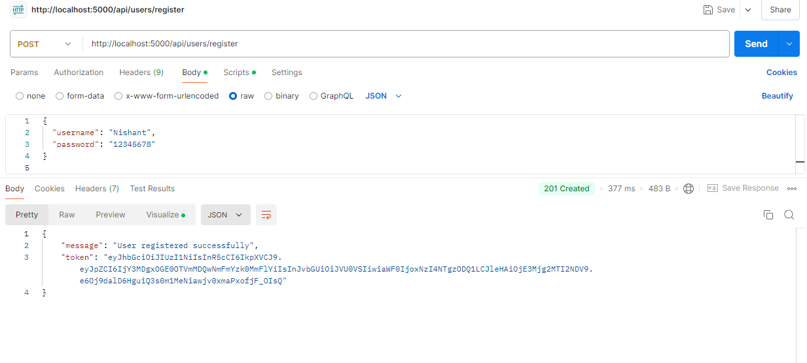
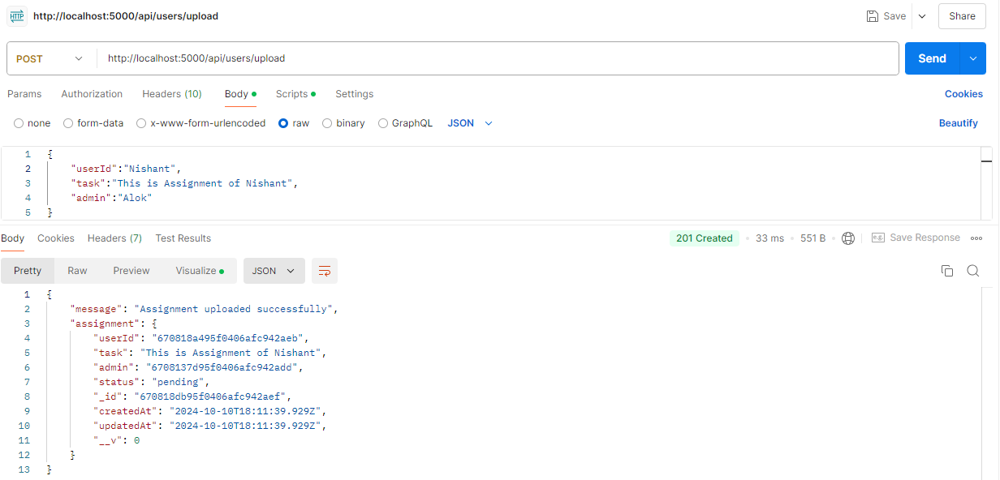
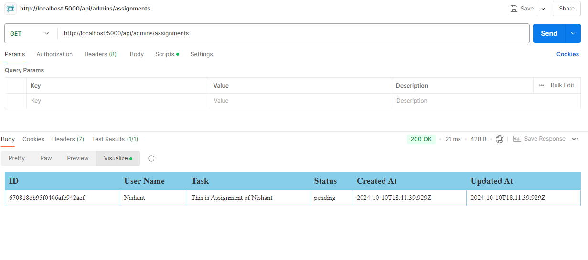
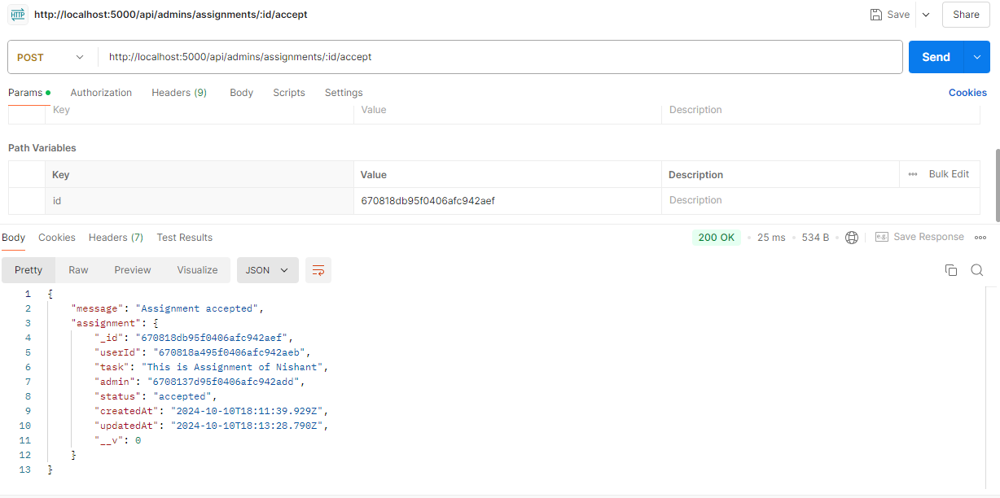

# Portal

This is a backend system for an Submission portal. The system supports two types of users:

- **Users**: Can upload assignments.
- **Admins**: Can view, accept, or reject assignments tagged to them.

## Postman Working Screenshots

- ### User Registration
  
- ### Assignment Upload
  
- ### Admin Assignment Fetch
  
- ### Accept Assignment
  

## Features

- User and Admin registration and login.
- Users can upload assignments.
- Admins can view, accept, or reject assignments.
- JWT-based authentication.
- Modular and structured code for maintainability.
- MongoDB as the database.

## Technologies Used

- **Node.js**: Backend runtime environment.
- **Express.js**: Web framework for Node.js.
- **MongoDB**: NoSQL database.
- **Mongoose**: ODM for MongoDB.
- **JWT (JSON Web Token)**: Authentication mechanism.
- **bcrypt.js**: Password hashing.
- **ES6+ (JavaScript)**: Modern JavaScript features.
- **dotenv**: Environment variables management.

## Prerequisites

- **Node.js**: Ensure Node.js is installed.
- **MongoDB**: Set up a MongoDB database (either locally or using a cloud service like MongoDB Atlas).
- **Postman** or **curl**: For API testing.

## Installation

### 1. Clone the Repository

```bash
git clone https://github.com/your-repo/portal.git
cd portal
```

### 2. Install Dependencies

```bash
npm install
```

### 3. Set Up Environment Variables

Create a `.env` file in the root of the project with the following variables:

```bash
MONGODB_URI=<your-mongodb-uri>
JWT_SECRET=<your-jwt-secret>
PORT=<your-port-optional>
```

### 4. Start the Server

To run the server, use the following command:

```bash
npm start
```

The server will be running at `http://localhost:5000` (or the port you specified).

---

## API Endpoints

### 1. User Registration

**Endpoint**: `POST /api/users/register`

Register a new user. The body should include:

```json
{
  "username": "Nishant",
  "password": "12345678"
}
```

### 2. User Login

**Endpoint**: `POST /api/users/login`

Authenticate an existing user. The body should include:

```json
{
  "username": "Nishant",
  "password": "12345678"
}
```

### 3. Upload Assignment

**Endpoint**: `POST /api/users/upload`

**Protected Route**: Requires `Authorization` header (JWT token). The body should include:

```json
{
  "userId": "Nishant",
  "task": "Hello World",
  "admin": "Alok"
}
```

### 4. Fetch All Admins

**Endpoint**: `GET /api/users/admins`

Returns a list of all registered admins.

---

### 5. Admin Registration

**Endpoint**: `POST /api/admins/register`

Register a new admin. The body should include:

```json
{
  "username": "Alok",
  "password": "12345678"
}
```

### 6. Admin Login

**Endpoint**: `POST /api/admins/login`

Authenticate an existing admin. The body should include:

```json
{
  "username": "Alok",
  "password": "12345678"
}
```

### 7. Get Assignments for Admin

**Endpoint**: `GET /api/admins/assignments`

**Protected Route**: Requires `Authorization` header (JWT token).

Returns all assignments tagged to the authenticated admin.

---

### 8. Accept Assignment

**Endpoint**: `POST /api/admins/assignments/:id/accept`

**Protected Route**: Requires `Authorization` header (JWT token).

Accept the assignment by its ID.

---

### 9. Reject Assignment

**Endpoint**: `POST /api/admins/assignments/:id/reject`

**Protected Route**: Requires `Authorization` header (JWT token).

Reject the assignment by its ID.
